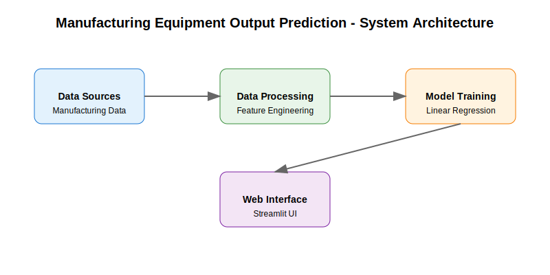
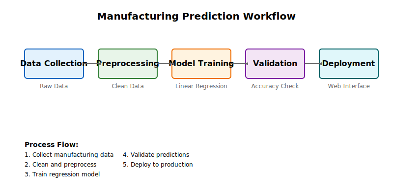
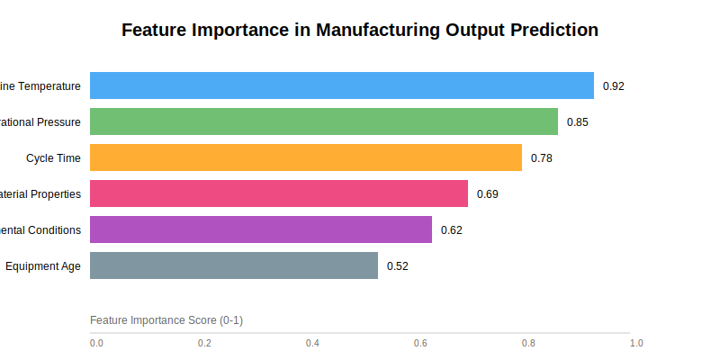
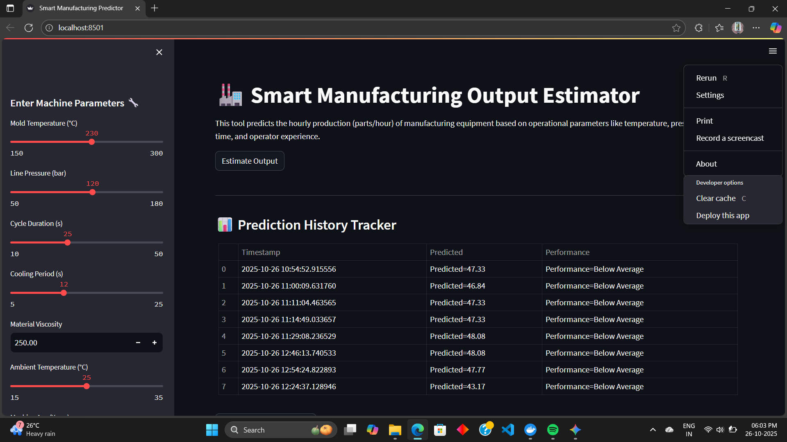
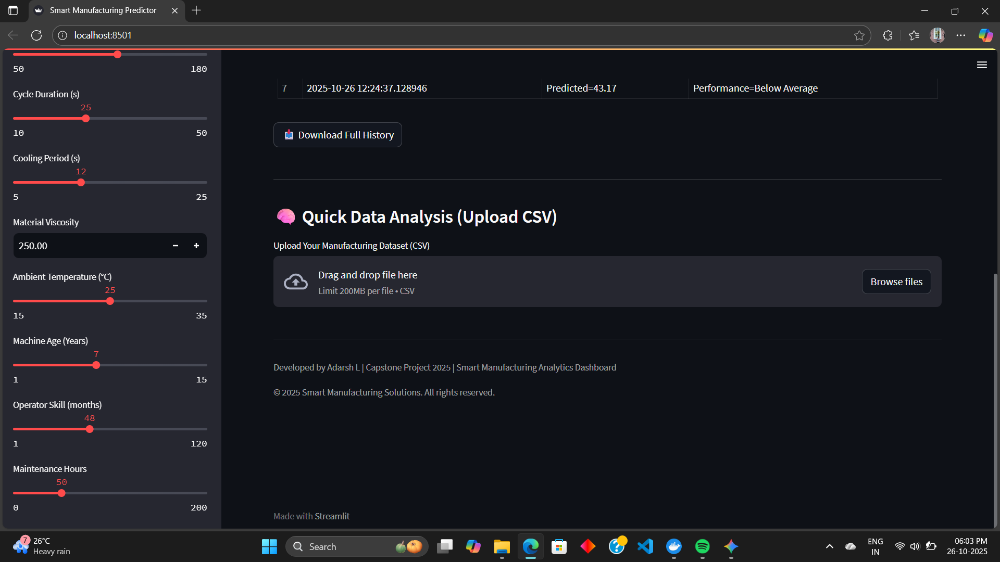

# Manufacturing Equipment Output Prediction





## Interface Screenshots



## Problem Statement

This Data Science Capstone Project addresses a critical manufacturing optimization challenge. We've developed a system for predicting injection molding machine output rates (parts per hour) using Linear Regression. By analyzing various machine operating parameters, this tool helps production teams optimize settings, plan schedules effectively, and identify underperforming equipment.

### Dataset Information
- **Source**: Synthetic Manufacturing Dataset (based on real manufacturing principles)
- **Size**: 5,000+ records of hourly machine performance data
- **Target Variable**: Parts produced per hour

### Features and Parameters
- **Injection Temperature**: 180-250°C (Molten plastic temperature)
- **Injection Pressure**: 80-150 bar (Hydraulic pressure)
- **Cycle Time**: 15-45 seconds (Time per part cycle)
- **Cooling Time**: 8-20 seconds (Part cooling duration)
- **Material Viscosity**: 100-400 Pa·s (Plastic material flow resistance)
- **Ambient Temperature**: 18-28°C (Factory floor temperature)
- **Machine Age**: 1-15 years
- **Operator Experience**: 1-120 months
- **Maintenance Hours**: 0-200 hours (since last maintenance)

## Project Components and Workflow

### 1. Data Processing Pipeline
- Data generation and validation
- Exploratory Data Analysis (EDA)
- Feature engineering and preprocessing
- Training/test data splitting

### 2. Model Development
- Linear Regression implementation
- Hyperparameter tuning
- Cross-validation
- Performance metrics (R², MSE, RMSE, MAE)

### 3. Production System
- Model serialization
- FastAPI backend
- Streamlit web interface
- Docker containerization

## Technical Stack

### Core Technologies
- Python 3.11
- Scikit-learn for ML
- Pandas & NumPy for data processing
- FastAPI for backend API
- Streamlit for web interface
- Docker for containerization

### Development Tools
- Git for version control
- pytest for unit testing
- black for code formatting
- flake8 for linting

## Setup Instructions

### Prerequisites
- Python 3.11 or higher
- Git
- pip (Python package manager)

### Installation Steps

1. Clone the repository
```powershell
git clone https://github.com/yourusername/Smart-Manufacturing-Estimator.git
cd Smart-Manufacturing-Estimator
```

2. Set up Python virtual environment
```powershell
python -m venv .venv
.\.venv\Scripts\Activate.ps1
```

3. Install required packages
```powershell
pip install -r requirements.txt
```

## Usage

### Training the Model
```powershell
python train_model.py
```
This will:
- Load the manufacturing dataset
- Preprocess the data
- Train a Linear Regression model
- Save the model to the `models/` directory

### Running the Web Interface
```powershell
python app_ui.py
```
The interface will be available at http://localhost:8501

### Making Predictions
Using the web interface:
1. Enter the manufacturing parameters
2. Click "Predict Output"
3. View the predicted output rate and confidence score

Using the custom script:
```powershell
python app_custom.py --input data/manufacturing_dataset_1000_samples.csv
```

### Data Format
The system expects manufacturing data with the following parameters:
- Machine Temperature
- Operational Pressure
- Manufacturing Cycle Time
- Material Properties
- Environmental Conditions
- Equipment Age
- Maintenance Metrics

## Project Structure
```
Smart-Manufacturing-Estimator/
├── app_custom.py         # FastAPI backend
├── app_ui.py            # Streamlit interface
├── train_model.py       # Training pipeline
├── requirements.txt     # Dependencies
├── Dockerfile          # Container config
├── docker-compose.yml  # Service orchestration
├── data/              # Datasets
│   └── manufacturing_dataset_1000_samples.csv
├── models/            # Saved models
├── logs/             # Application logs
└── tests/            # Unit tests
```

## Performance Metrics

### Success Criteria
- R² > 0.75 on test data
- Mean Absolute Error < 5% of output range
- 95% prediction interval coverage
- Sub-second response time for predictions

### Model Validation
- Linear regression assumptions verified
- Cross-validation scores
- Residual analysis
- Feature importance ranking

## Contributor Guidelines

### Getting Started
1. Fork the repository
2. Create a feature branch
```powershell
git checkout -b feature/your-feature-name
```
3. Make your changes
4. Submit a pull request

### Code Style
- Follow PEP 8 standards
- Include docstrings for all functions
- Add comments for complex logic
- Maintain the existing project structure

### Testing
- Write unit tests for new features
- Ensure all tests pass before submitting PR
- Include test cases in the PR description

## License

MIT License

Copyright (c) 2025 Smart Manufacturing Estimator Team

Permission is hereby granted, free of charge, to any person obtaining a copy
of this software and associated documentation files (the "Software"), to deal
in the Software without restriction, including without limitation the rights
to use, copy, modify, merge, publish, distribute, sublicense, and/or sell
copies of the Software, and to permit persons to whom the Software is
furnished to do so, subject to the following conditions:

The above copyright notice and this permission notice shall be included in all
copies or substantial portions of the Software.

THE SOFTWARE IS PROVIDED "AS IS", WITHOUT WARRANTY OF ANY KIND, EXPRESS OR
IMPLIED, INCLUDING BUT NOT LIMITED TO THE WARRANTIES OF MERCHANTABILITY,
FITNESS FOR A PARTICULAR PURPOSE AND NONINFRINGEMENT. IN NO EVENT SHALL THE
AUTHORS OR COPYRIGHT HOLDERS BE LIABLE FOR ANY CLAIM, DAMAGES OR OTHER
LIABILITY, WHETHER IN AN ACTION OF CONTRACT, TORT OR OTHERWISE, ARISING FROM,
OUT OF OR IN CONNECTION WITH THE SOFTWARE OR THE USE OR OTHER DEALINGS IN THE
SOFTWARE.
